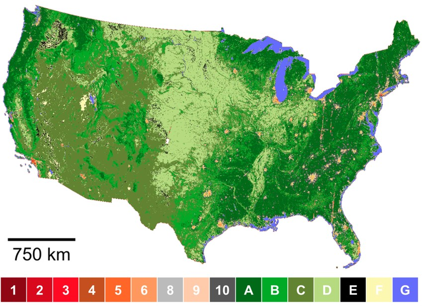

# Project Title

Mapping Urban Form into Local Climate Zones for the Continental US from 1986-2020

## Description

This project contains the scripts used to develop national longitudinal LCZ models using contextual random forest classifiers.
The hybrid modeling pipeline includes 
(1) crowdsourced and expert training area labeling, 
(2) local model fine-tuning and cloud model reproduction, 
and (3) large-scale LCZ surface mapping and post-classification processing. 
The training data sampling, feature collection, model finetune and prediction were developed using python. 
The final prediction surfaces with post-classification were derived using Google Earth Engine.
As the final product, this project provides longitudinal LCZ maps with fine spatial resolution (100 meters) for the continental US from 1986 to 2020.

## Authors
**Author:** [Meng Qi](https://scholar.google.com/citations?user=ycTMzigAAAAJ&hl=en)  
**Principal Investigator:** [Steve Hankey](https://scholar.google.com/citations?user=HLK7uAkAAAAJ&hl=en)  
**Affiliation:** [Virginia Tech, School of Public and International Affairs](https://spia.vt.edu/)  